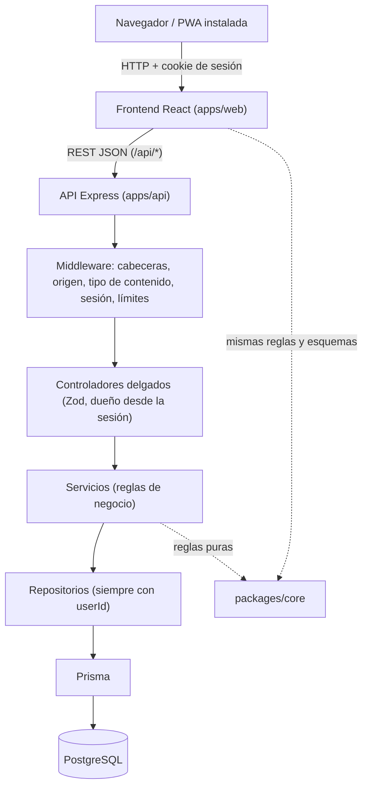
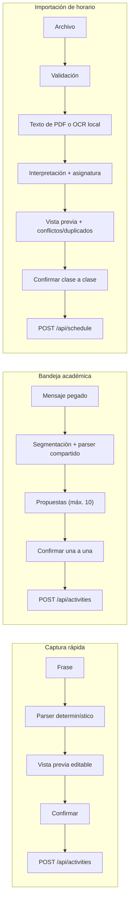

# Arquitectura

Academic Planner es una aplicación web progresiva (PWA) para organizar asignaturas, actividades, agenda y progreso académico. Este documento describe cómo está construida **hoy**; las decisiones y sus motivos están en [decisions.md](decisions.md) y el contrato de la API en [api.md](api.md).

## Stack real

Versiones tomadas de `package.json` / `package-lock.json` (rangos) y de `node_modules` (instaladas).

| Capa                   | Tecnología                                                                                                         |
| ---------------------- | ------------------------------------------------------------------------------------------------------------------ |
| Lenguaje               | TypeScript 5.9 en todo el repositorio                                                                              |
| Frontend               | React 19.3, Vite 8.3, Tailwind CSS 4.3, React Router 8.4, TanStack Query 5, Zod 4                                  |
| Formularios            | Estado de React + esquemas Zod compartidos (no se usa React Hook Form)                                             |
| Backend                | Node.js (≥ 22.18; probado con 24), Express 5.2, Zod 4                                                              |
| Base de datos          | PostgreSQL 17 (Docker Compose), Prisma 7.10 con `@prisma/adapter-pg`                                               |
| Autenticación          | Sesiones en la base de datos, contraseñas con Argon2id (`argon2`), cookie `HttpOnly`                               |
| Seguridad HTTP         | `helmet`, `cors`, `express-rate-limit`, verificación de origen propia (CSRF), CSP estricta                         |
| PWA                    | `vite-plugin-pwa` 2.0 (Workbox `generateSW`, `workbox-window`)                                                     |
| Importación de horario | `tesseract.js` 7 (OCR local, modelo `@tesseract.js-data/spa`), `unpdf` (texto de PDF), `@napi-rs/canvas`, `multer` |
| Pruebas                | Vitest 5, Supertest, Playwright 1.63, `@axe-core/playwright`                                                       |
| Herramientas           | ESLint 10, Prettier 3, `concurrently`, `tsx`                                                                       |

No se usa ningún servicio externo: ni IA generativa, ni APIs de OCR, ni proveedores de correo, ni notificaciones push.

## Vista general



- Las **reglas puras** (fechas, Radar, Atención, progreso, carga, recordatorios, interpretación de texto) y los **esquemas Zod** viven en `packages/core` y los usan tanto la API como la interfaz.
- Las capas de la API no se saltan niveles: una ruta nunca habla con Prisma; un repositorio nunca decide una regla.
- En producción la API puede servir la app compilada (`WEB_DIST_DIR`) en el **mismo origen**; ver [deployment.md](deployment.md).

## Monorepo (npm workspaces)

| Carpeta         | Responsabilidad                                                                                                                                  |
| --------------- | ------------------------------------------------------------------------------------------------------------------------------------------------ |
| `apps/api`      | Servidor Express: rutas, controladores, servicios, repositorios, Prisma (`prisma/schema.prisma`, migraciones), importación de horario, seed demo |
| `apps/web`      | Interfaz React: páginas, componentes, cliente de la API, PWA (`src/pwa/`), pruebas de interfaz                                                   |
| `packages/core` | Dominio puro compartido (se compila a `dist/`; reconstruir con `npm run build -w @planner/core` tras cambiarlo)                                  |
| `e2e`           | Pruebas Playwright (360 px y 1366 px), seguridad en navegador, validación de sistema, demo                                                       |
| `docs`          | Documentación (índice en [README.md](README.md))                                                                                                 |
| `scripts`       | `security-scan.mjs` (escaneo de secretos) y `docs-check.mjs` (enlaces y scripts de la documentación)                                             |

## Capas de la API

Ruta → controlador → servicio → repositorio → Prisma.

1. **Ruta:** monta los middleware (`requireAuth`, límites) y el controlador.
2. **Controlador:** valida la entrada con Zod (`strictObject`: rechaza `userId` y campos internos) y toma el dueño **de la sesión**, nunca del cuerpo.
3. **Servicio:** reglas de negocio, transacciones, reloj inyectable (`clock`).
4. **Repositorio:** todas las consultas filtran por `userId`. Un recurso ajeno o inexistente responde el mismo 404.
5. **Prisma:** `relationLoadStrategy: 'join'` para evitar N+1; el Dashboard usa un número constante de consultas.

Las escrituras que tocan varias tablas (actividad + recordatorios) van en una transacción; las ediciones concurrentes de una actividad se serializan con `SELECT … FOR UPDATE`.

## Dominio compartido (`packages/core`)

Existe para que **una regla tenga una sola definición**. Si la interfaz y la API calcularan por separado el Radar o «hoy», acabarían discrepando.

| Módulo (`src/`)                                                        | Contenido                                                                              |
| ---------------------------------------------------------------------- | -------------------------------------------------------------------------------------- |
| `time.ts`, `calendar.ts`                                               | Zona horaria, instantes UTC ↔ hora local, semanas lunes–domingo, aritmética de fechas  |
| `academic.ts`, `activity.ts`, `schedule.ts`, `auth.ts`, `reminders.ts` | Esquemas Zod de entrada/salida y reglas puras de cada entidad                          |
| `radar.ts`, `attention.ts`, `insights.ts`, `dashboard.ts`              | Radar académico, «¿Qué hago ahora?», progreso y carga semanal, resumen                 |
| `captureShared.ts`, `quickCapture.ts`, `academicInbox.ts`              | Interpretación determinística de frases y mensajes                                     |
| `scheduleImport.ts`                                                    | Interpretación de horarios sobre una representación intermedia (palabras con posición) |
| `zodRuntime.ts`                                                        | Zod en modo `jitless` en el navegador (la CSP prohíbe `new Function`)                  |

## Flujos «proponer, no crear»

Captura rápida, Bandeja académica e Importación de horario **solo proponen**; nada se guarda hasta que el estudiante confirma, y confirmar usa los mismos endpoints de creación que los formularios manuales (no existe un camino de creación propio).



Detalle: [quick-capture.md](quick-capture.md), [academic-inbox.md](academic-inbox.md), [schedule-import.md](schedule-import.md).

## Datos derivados

No se guardan: «vencida», categoría del Radar, puntaje de Atención, progreso ni carga semanal. Se calculan en cada lectura a partir de `dueAt`, `status`, las ocurrencias de la agenda y un reloj inyectable. Así no hay datos que caduquen ni que puedan contradecirse. Ver [data-model.md](data-model.md#datos-derivados-no-se-almacenan) y las reglas exactas en [domain-rules.md](domain-rules.md).

## Frontend

- **Rutas** (`apps/web/src/App.tsx`): públicas `/login`, `/register`, `/status`; protegidas `/onboarding` y, con periodo actual, `/dashboard`, `/subjects`, `/activities`, `/calendar`, `/calendar/import`, `/radar`, `/progress`, `/inbox`; cualquier otra ruta muestra la pantalla 404. Las pantallas secundarias se cargan con `React.lazy`.
- **Datos del servidor:** TanStack Query; las mutaciones de actividades invalidan `['activities']`, el Dashboard y `['reminders']`. Un refresco fallido no reemplaza datos ya mostrados.
- **Hora:** la interfaz no hace matemática de zonas; usa los ayudantes de `packages/core` y siempre muestra 12 h con a. m./p. m.
- **PWA:** service worker que precachea solo el shell; `/api/*` siempre por red (ver [pwa.md](pwa.md)).

## Árbol simplificado

```
academic-planner/
├── apps/
│   ├── api/            prisma/ (schema + migraciones), src/ (routes, controllers, services, repositories,
│   │                   middleware, auth, scheduleImport, demo, security tests…), test/ (BD de test)
│   └── web/            src/ (pages, components, api, pwa, auth), public/ (iconos), vite.config.ts
├── packages/core/      src/ (reglas puras + esquemas), dist/ (generado)
├── e2e/                *.spec.ts de Playwright
├── docs/               documentación
├── scripts/            security-scan.mjs, docs-check.mjs
├── docker-compose.yml  PostgreSQL 17 (puerto host 5433)
├── playwright.config.ts · playwright.security.config.ts
└── .env.example        variables de entorno (sin secretos)
```

## Puertos de desarrollo

| Servicio               | Puerto | Nota                                                                    |
| ---------------------- | -----: | ----------------------------------------------------------------------- |
| Web (Vite)             |   5173 | `WEB_PORT`; proxy de `/api` hacia la API                                |
| API (Express)          |   3000 | `API_PORT`                                                              |
| PostgreSQL (Docker)    |   5433 | Puerto del host; el contenedor usa 5432. Evita chocar con un 5432 local |
| Seguridad en navegador |   4300 | Topología de producción de `npm run test:security:browser`              |
