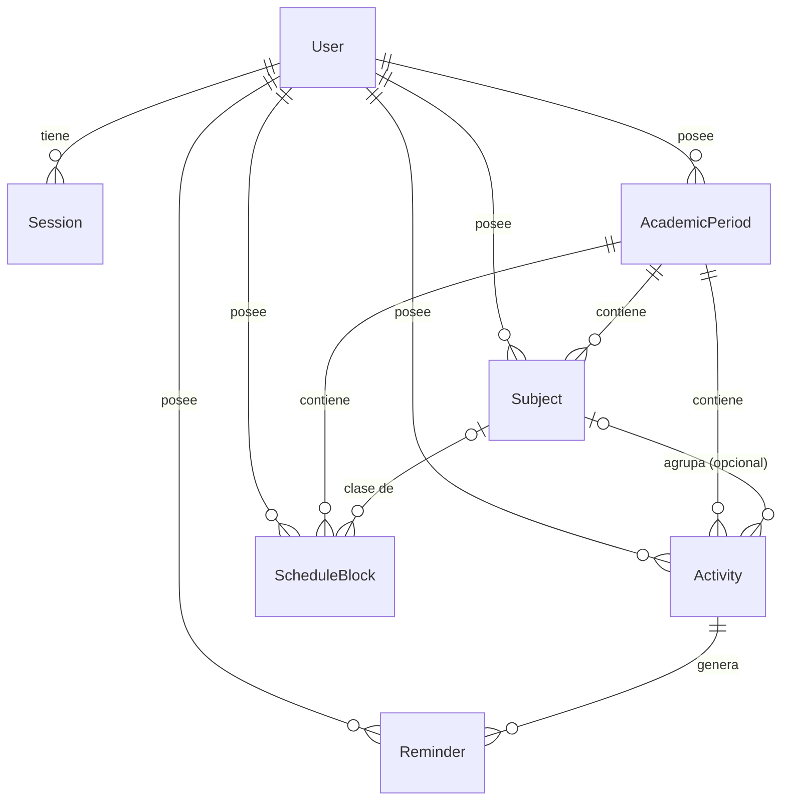

# Modelo de datos

Fuente de verdad: [`apps/api/prisma/schema.prisma`](../apps/api/prisma/schema.prisma) y las migraciones de `apps/api/prisma/migrations/`. Este documento explica las entidades y reglas; no copia el esquema línea por línea. PostgreSQL 17, gestionado con Prisma 7.

## Diagrama simplificado

## Relaciones

| Relación                                                                      | Cardinalidad | Borrado                                                                                                       |
| ----------------------------------------------------------------------------- | ------------ | ------------------------------------------------------------------------------------------------------------- |
| `User` → `Session`                                                            | 1:N          | En cascada con el usuario                                                                                     |
| `User` → `AcademicPeriod`, `Subject`, `Activity`, `ScheduleBlock`, `Reminder` | 1:N          | En cascada con el usuario (borrar un usuario elimina todo lo suyo)                                            |
| `AcademicPeriod` → `Subject`                                                  | 1:N          | **No en cascada** (`NO ACTION`): un periodo con asignaturas no se puede borrar (409)                          |
| `AcademicPeriod` → `ScheduleBlock`                                            | 1:N          | **No en cascada**: un periodo con bloques no se puede borrar                                                  |
| `AcademicPeriod` → `Activity`                                                 | 1:N          | **No en cascada**: un periodo con actividades (también generales) no se puede borrar (409)                    |
| `Subject` → `Activity`                                                        | 1:N opcional | **No en cascada**: una asignatura con actividades o bloques no se puede borrar (409); `subjectId` es opcional |
| `Subject` → `ScheduleBlock`                                                   | 1:N opcional | **No en cascada**; `subjectId` es opcional (una sesión de estudio puede no tener asignatura)                  |
| `Activity` → `Reminder`                                                       | 1:N          | **En cascada**: borrar una actividad borra sus recordatorios                                                  |

Una `Activity` **guarda su periodo** (`periodId`, obligatorio, inmutable) y su asignatura es **opcional** (F1). Si hay asignatura, la clave foránea compuesta `(subjectId, periodId) → Subject(id, periodId)` hace que la **propia base de datos** rechace una asignatura de otro periodo. Detalle y decisiones: [activities.md](activities.md#el-periodo-sí-se-guarda-en-activity-la-asignatura-es-opcional-f1).

## Entidades

### User

`name`, `email` (único, siempre recortado y en minúsculas), `passwordHash` (Argon2id), `timezone` (por defecto `America/Bogota`). La zona horaria es la **autoridad** para «hoy», el saludo, la semana y el día en que vence una actividad sin hora. No hay pantalla para cambiarla (ver [limitations.md](limitations.md)).

### Session

Sesión en servidor. Guarda `tokenHash` (SHA-256 del token aleatorio de 256 bits; el token en claro **nunca** se almacena), `expiresAt` (7 días fijos desde su creación), `lastUsedAt`. Máximo 20 sesiones vivas por usuario (se descartan las más antiguas). Detalle en [security.md](security.md).

### AcademicPeriod

`name`, `startDate`, `endDate` (**fechas de calendario** `DATE`, sin hora ni zona: «2026-08-03» no puede correrse al día 2 por una conversión), `isCurrent`. Restricciones a mano en la migración: **un solo periodo actual por usuario** (índice único parcial) y `endDate > startDate`.

### Subject

`name` (como lo escribió el usuario), `nameKey` (normalizado: minúsculas, sin acentos, espacios colapsados), `professor?`, `color` (uno de los 10 hex de la paleta fija, validado en `core`), `description?`. Único `(periodId, nameKey)`: no se repiten asignaturas «iguales» dentro de un periodo.

### Activity

| Campo         | Significado                                                                                                                                                                                     |
| ------------- | ----------------------------------------------------------------------------------------------------------------------------------------------------------------------------------------------- |
| `periodId`    | Periodo al que pertenece. **Obligatorio e inmutable**; lo deriva el servidor (el de la asignatura, o el periodo actual si no hay asignatura). No forma parte del DTO público                    |
| `subjectId`   | Asignatura **opcional**. Nulo = actividad general (sin asignatura). Con valor, su periodo es el mismo `periodId` (clave foránea compuesta)                                                      |
| `type`        | `TASK`, `EXAM`, `QUIZ`, `PROJECT`, `PRESENTATION`, `WORKSHOP`, `READING`, `OTHER` (por defecto `TASK`)                                                                                          |
| `priority`    | `LOW`, `MEDIUM`, `HIGH` (por defecto `MEDIUM`)                                                                                                                                                  |
| `status`      | `PENDING`, `IN_PROGRESS`, `COMPLETED` (por defecto `PENDING`)                                                                                                                                   |
| `dueAt`       | **Instante UTC**. Con `hasTime = false` es el **final del día local** del usuario (23:59:59.999)                                                                                                |
| `hasTime`     | Si el estudiante indicó hora. Sin hora no se inventa «11:59 p. m.» en pantalla                                                                                                                  |
| `completedAt` | Lo fija el **backend**, nunca el cliente: pasar a `COMPLETED` estampa «ahora», seguir finalizada conserva la marca, reabrir la borra. Restricción: `status = COMPLETED` ⇔ `completedAt` no nulo |

Límites de texto: título 150 caracteres, descripción 2000.

### ScheduleBlock

Una fila por bloque **o por serie semanal**; las ocurrencias se expanden al leer, solo para el rango pedido.

| Campo                    | Significado                                                                                                                           |
| ------------------------ | ------------------------------------------------------------------------------------------------------------------------------------- |
| `type`                   | `CLASS`, `STUDY`, `ACADEMIC_PERSONAL` (una clase exige asignatura)                                                                    |
| `periodId`, `subjectId?` | Periodo (siempre) y asignatura (opcional salvo en clases); la asignatura debe ser del mismo periodo                                   |
| `startAt`, `endAt`       | Instantes UTC de la **primera** (o única) ocurrencia. Restricción: `endAt > startAt` y duración ≤ 24 h                                |
| `recurrenceType`         | `NONE` o `WEEKLY`                                                                                                                     |
| `recurrenceUntil`        | Fecha local inclusiva en que termina la serie (no puede pasar del fin del periodo). Restricción: `WEEKLY` ⇔ `recurrenceUntil` no nulo |

El día de la semana no se guarda: es el de la primera ocurrencia en la zona del usuario. Una serie repite la **misma hora de pared** cada 7 días **de calendario** (no cada 168 horas), así que conserva su hora aunque cambie el desfase horario.

### Reminder

Recordatorio **interno** (dentro de la app). Solo guarda el _cuándo_; el mensaje se deriva de la actividad al mostrarlo (renombrar la actividad renombra sus recordatorios).

| Campo           | Significado                                                                                                                          |
| --------------- | ------------------------------------------------------------------------------------------------------------------------------------ |
| `kind`          | `AUTO` (generado por las reglas del tipo de actividad) o `MANUAL` (lo eligió el estudiante; nunca se recalcula)                      |
| `status`        | `PENDING` (aún no mostrado) → `SHOWN` (la app lo mostró) o `CANCELLED` (la actividad se finalizó)                                    |
| `offsetMinutes` | Solo `AUTO`: minutos **negativos** respecto a `dueAt` (`remindAt = dueAt + offset`). Restricción: `AUTO` ⇔ offset no nulo y negativo |
| `remindAt`      | Instante UTC en que debe mostrarse                                                                                                   |

Índice único parcial: una actividad no puede tener dos `AUTO` con el mismo offset. Reglas por tipo y ciclo de vida: [reminders.md](reminders.md).

## Datos derivados (no se almacenan)

Se calculan en cada lectura con un reloj inyectable; guardarlos obligaría a mantenerlos al día y permitiría que se contradijeran.

| Dato                        | Se deriva de                                                                  | Dónde                                                |
| --------------------------- | ----------------------------------------------------------------------------- | ---------------------------------------------------- |
| Vencida                     | `dueAt < ahora` y `status ≠ COMPLETED`                                        | [activities.md](activities.md)                       |
| Categoría del Radar         | Tiempo restante hasta `dueAt` (duración real)                                 | [radar.md](radar.md)                                 |
| Puntaje y orden de Atención | Radar + prioridad + estado + plazo (el puntaje nunca se muestra ni se guarda) | [attention-engine.md](attention-engine.md)           |
| Progreso                    | Actividades finalizadas / registradas                                         | [progress-and-workload.md](progress-and-workload.md) |
| Carga semanal               | Actividades que vencen en la semana + ocurrencias de la agenda                | [progress-and-workload.md](progress-and-workload.md) |
| Mensaje de un recordatorio  | Título y plazo actuales de la actividad                                       | [reminders.md](reminders.md)                         |
| Ocurrencias de una clase    | La fila de la serie y el rango consultado                                     | [schedule.md](schedule.md)                           |

## Convenciones de tiempo

- Instantes: `timestamptz` (UTC). La API los intercambia en ISO 8601 con `Z`; la interfaz los localiza con `User.timezone`.
- Días de calendario (periodos, `recurrenceUntil`): `DATE`, intercambiados como `YYYY-MM-DD`.
- Semana: **lunes a domingo**, en la zona del usuario.
- Actividad sin hora: vence al **final del día local**.

## Migraciones

Seis migraciones aplicadas en orden (`init`, `auth_user_session_drop_app_metadata`, `academic_periods_and_subjects`, `activities`, `schedule_blocks`, `reminders`). Las invariantes que Prisma no sabe expresar (índices únicos parciales, `CHECK`) están escritas a mano al final de cada migración. **Nunca se edita una migración ya aplicada**: se crea otra.
