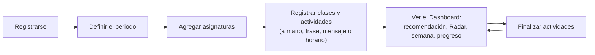
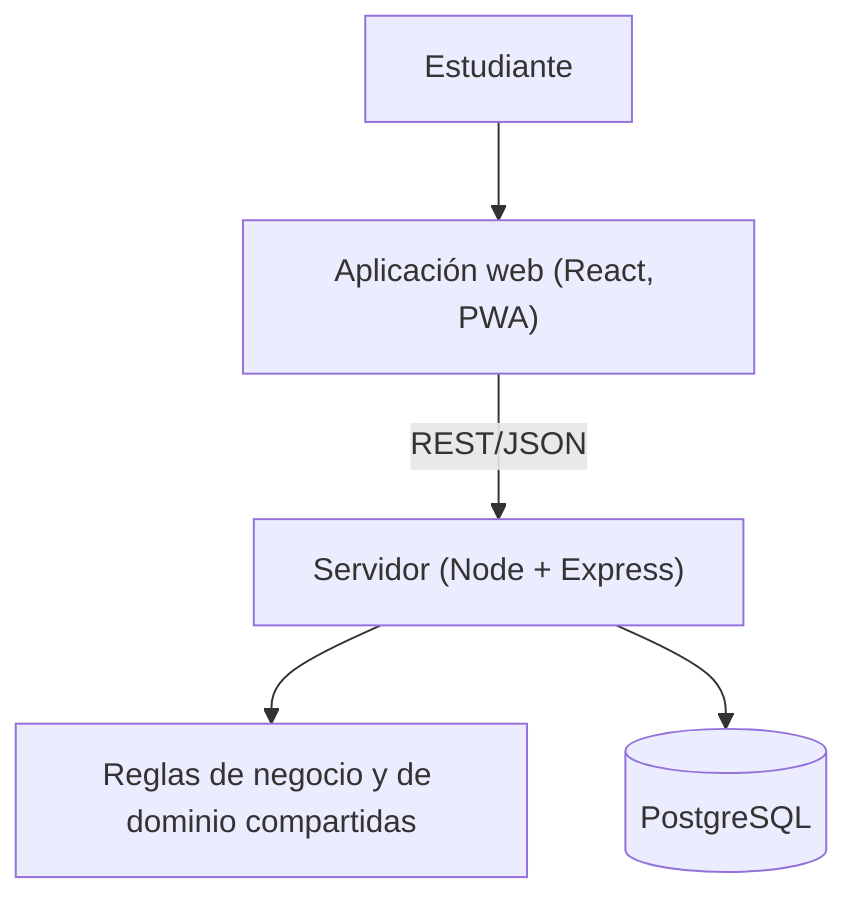

# Descripción general del sistema

Este documento explica **qué es Academic Planner y cómo está construido** sin necesidad de leer código. Los detalles técnicos están enlazados al final de cada sección; el índice completo es [README.md](README.md).

## El problema que aborda

Un estudiante universitario reparte sus compromisos en varios lugares: mensajes de los profesores, un horario en imagen o PDF, notas sueltas, fechas de parciales y entregas. Organizar todo eso exige muchos pasos manuales y repetidos (escribir cada actividad, anotar cada clase, revisar qué vence primero).

Academic Planner **busca facilitar** esa organización: centraliza asignaturas, actividades y agenda en un solo lugar, calcula a partir de esos datos qué requiere atención primero y reduce los pasos operativos para registrar información (escribiendo una frase, pegando un mensaje o subiendo un horario). El principio de diseño es que _organizarse no debe convertirse en otra tarea_.

El sistema **no mide** ni afirma efectos sobre el rendimiento, el estrés o el bienestar del estudiante; lo que se ha comprobado es que funciona como se describe aquí ([system-validation.md](system-validation.md)).

## Usuarios

Estudiantes universitarios con una cuenta personal. Cada estudiante ve y modifica **solo sus propios datos**. No hay roles (docentes, administradores) ni cuentas compartidas.

## Qué permite hacer

| Función                     | Descripción                                                                                                              |
| --------------------------- | ------------------------------------------------------------------------------------------------------------------------ |
| Cuenta y sesión             | Registro e inicio de sesión; la sesión dura 7 días                                                                       |
| Periodo académico           | El estudiante define el semestre (nombre, inicio y fin) al comenzar                                                      |
| Asignaturas                 | Crear, editar y eliminar asignaturas del periodo, con color, profesor y descripción opcionales                           |
| Actividades                 | Tareas, parciales, quices, proyectos, exposiciones, talleres y lecturas, con fecha (y hora opcional), prioridad y estado |
| Filtros                     | Por asignatura, estado, prioridad, tipo, vencidas, categoría del Radar y rango de fechas                                 |
| Agenda                      | Clases y otros bloques, con repetición semanal hasta una fecha y aviso (no bloqueo) cuando dos bloques se solapan        |
| Recordatorios               | Avisos dentro de la aplicación: automáticos según el tipo de actividad y manuales                                        |
| Radar académico             | Clasifica lo pendiente en cinco categorías según el tiempo restante                                                      |
| ¿Qué hago ahora?            | Señala a qué actividad prestar atención primero y explica por qué                                                        |
| Progreso y carga semanal    | Cuántas actividades están finalizadas y cuántos compromisos tiene la semana (descriptivo, sin juicios)                   |
| Captura rápida              | Se escribe una frase («parcial redes martes 10am») y se propone una actividad para confirmar                             |
| Bandeja académica           | Se pega un mensaje largo y se proponen hasta 10 actividades para revisar y confirmar                                     |
| Importación de horario      | Se sube una imagen o PDF del horario y se proponen clases para revisar y confirmar                                       |
| Aplicación instalable (PWA) | Se puede instalar en el dispositivo; sin conexión solo abre la estructura de la app, los datos requieren conexión        |

## Flujo típico

Las tres vías automáticas de registro siguen siempre el mismo patrón, **Capturar → Interpretar → Confirmar**: el sistema propone, el estudiante revisa y edita, y solo al confirmar se guarda algo. El sistema nunca crea una asignatura por su cuenta.

## Cómo piensa el sistema (sin inteligencia artificial)

Todo lo que «interpreta» o «recomienda» son **reglas determinísticas y explicables**:

- **Radar:** según el tiempo que falta (vencida, menos de 24 h, hasta 3 días, hasta 7 días, más de 7 días).
- **¿Qué hago ahora?:** combina esa categoría con la prioridad y el estado, y siempre muestra las razones.
- **Intérpretes de texto:** diccionarios y reglas de fechas en español; cada dato propuesto indica qué tan seguro es.
- **OCR:** reconocimiento de texto clásico, ejecutado en el propio servidor.

No se usa ningún modelo de lenguaje ni servicio de terceros: el texto y los archivos del estudiante no salen de la aplicación. La misma entrada produce siempre el mismo resultado, lo que permite probar y explicar cada decisión.

Radar, atención, progreso y carga **se calculan cada vez que se consultan**; no se guardan, así que nunca pueden quedar desactualizados ni contradecir a los datos originales.

## Arquitectura general

- **Interfaz** (React + Vite): pantallas, formularios y la PWA.
- **Servidor** (Node + Express): valida cada petición, aplica las reglas y accede a la base de datos.
- **Reglas de dominio compartidas** (`packages/core`): fechas, Radar, atención, progreso, intérpretes de texto; las usan servidor e interfaz para que no haya dos versiones de una misma regla.
- **Base de datos** (PostgreSQL): usuarios, sesiones, periodos, asignaturas, actividades, bloques de agenda y recordatorios.

Más detalle: [architecture.md](architecture.md), [data-model.md](data-model.md), [api.md](api.md).

## Fechas y zona horaria

Los instantes se guardan en UTC y el perfil de cada estudiante tiene una zona horaria (por defecto `America/Bogota`) que decide qué es «hoy», qué semana es (lunes a domingo) y cuándo vence una actividad sin hora (al final de su día local). La interfaz muestra siempre horas de 12 horas con a. m./p. m.

## Seguridad y privacidad

Se realizó un **endurecimiento de seguridad** (no es una prueba de penetración): contraseñas con Argon2id; sesiones en el servidor con token aleatorio del que solo se guarda su huella; cookie protegida (`HttpOnly`, `SameSite`, `Secure` y prefijo `__Host-` en producción); protección contra peticiones desde otros sitios; política de contenido estricta; aislamiento total entre usuarios (un recurso ajeno responde igual que uno inexistente); límites de frecuencia y de tamaño de archivos; respuestas de la API sin caché; y errores genéricos hacia el cliente. Los archivos subidos no se guardan y nada se envía a terceros. Limitaciones conocidas (sin verificación de correo, sin recuperación de contraseña, sin MFA, límites en memoria): [security.md](security.md), [limitations.md](limitations.md).

## Validación

Ver [testing.md](testing.md) y [system-validation.md](system-validation.md). En resumen: reglas de dominio y API probadas con una base de datos real (1585 pruebas Vitest), recorridos de navegador a 360 y 1366 px (258 ejecuciones por pasada), pruebas de seguridad, evaluación de accesibilidad con axe y teclado, un escenario de un semestre completo contrastado con la API, e instalación desde cero reproducida. Se **validó mediante pruebas automatizadas, de integración y de extremo a extremo**; eso no equivale a «sin errores».

## Limitaciones principales

No probado en dispositivos móviles reales; HTTPS y proxy reales sin validar y sin despliegue; sin sincronización con calendarios externos, sin notificaciones fuera de la app y sin modo sin conexión para datos; la importación de horario puede equivocarse y exige revisión; los intérpretes de texto solo entienden los fraseos previstos, en español. Lista completa: [limitations.md](limitations.md).

## Demostración

Un comando crea un estudiante ficticio con un semestre completo para presentar el sistema: [demo.md](demo.md). Los datos son sintéticos.
